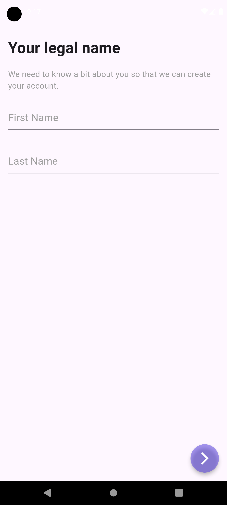
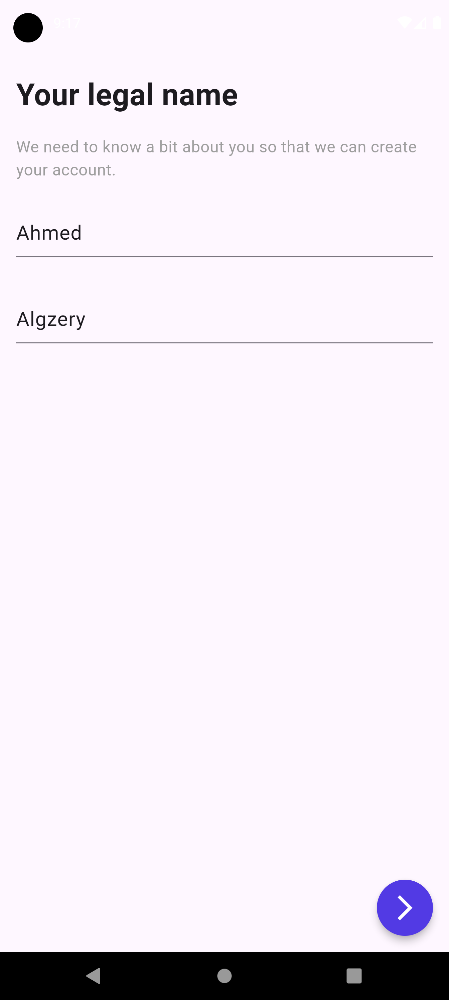
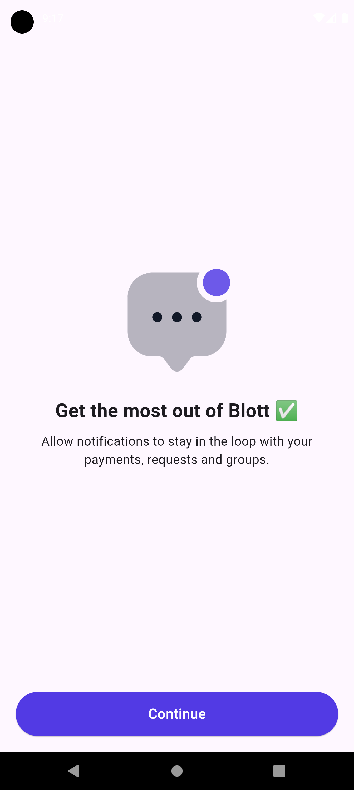

# Blott Notification App

This Flutter application showcases a notification prompt that mimics the iOS style for requesting permission to send notifications. The app also follows a **Clean Architecture** approach, ensuring modularity and maintainability of the codebase.

## Features

- iOS-style notification prompt with "Allow" and "Don't Allow" buttons.
- Notifications that alert users about updates and messages.
- User-friendly UI, optimized for both Android and iOS.
- Local storage for saving user preferences using `shared_preferences`.
- Network images with caching for optimized performance.
- Beautiful fonts and icons with Google Fonts and Cupertino Icons.

## Screenshots

| Splash | LegalName1 | LegalName2 | Notification Request1 | Notification Request2 | News Screen |
|--------|------------|------------|-----------------------|-----------------------|-------------|
|  |  |  |  |  |  |


## Getting Started

### Prerequisites

- [Flutter SDK](https://flutter.dev/docs/get-started/install) >= 3.4.0

### Installation

1. Clone the repository:

    ```bash
    git clone https://github.com/algzery-ahmed/blott-notification-app.git
    cd blott-notification-app
    ```

2. Install dependencies:

    ```bash
    flutter pub get
    ```

3. Run the app:

    ```bash
    flutter run
    ```

### Project Structure

This project follows the **Clean Architecture** principles, organized into the following layers:

- **Data Layer**: Handles data sources and repositories.
- **Domain Layer**: Business logic and entities.
- **Presentation Layer**: UI code, widgets, and state management using `flutter_bloc`.

### Packages Used

Here is the list of packages utilized in the project:

- **[cupertino_icons](https://pub.dev/packages/cupertino_icons)**: iOS-style icons.
- **[intl](https://pub.dev/packages/intl)**: Internationalization and localization support.
- **[flutter_bloc](https://pub.dev/packages/flutter_bloc)**: Bloc for state management.
- **[get_it](https://pub.dev/packages/get_it)**: Service locator for dependency injection.
- **[dio](https://pub.dev/packages/dio)**: Powerful HTTP client for Dart.
- **[url_launcher](https://pub.dev/packages/url_launcher)**: Launch URLs, emails, and more.
- **[gap](https://pub.dev/packages/gap)**: Simple gap widget for spacing.
- **[cached_network_image](https://pub.dev/packages/cached_network_image)**: For efficient image loading and caching.
- **[equatable](https://pub.dev/packages/equatable)**: Simplifies equality comparisons.
- **[google_fonts](https://pub.dev/packages/google_fonts)**: Access to Google Fonts.
- **[flutter_svg](https://pub.dev/packages/flutter_svg)**: For rendering SVGs.
- **[flutter_animate](https://pub.dev/packages/flutter_animate)**: A simple way to add animations to widgets.
- **[shared_preferences](https://pub.dev/packages/shared_preferences)**: Store simple data like user preferences locally.

### Architecture

The project is structured into three layers:

- **Presentation Layer**: Responsible for the UI and state management using `flutter_bloc`.
- **Domain Layer**: Manages business logic with use cases and entities.
- **Data Layer**: Handles API calls using `dio`, caching images, and managing shared preferences for local storage.

## Usage

1. **Notification Prompt**: When the app starts, you will see an iOS-style dialog requesting notification permission. Depending on the user's response:
    - **Allow**: Navigates to the News screen.
    - **Don’t Allow**: Dismisses the dialog without further action.
   
2. **News Screen**: Displays a list of news items once the user allows notifications.

## License

This project is licensed under the MIT License. See the [LICENSE](LICENSE) file for more information.

---
